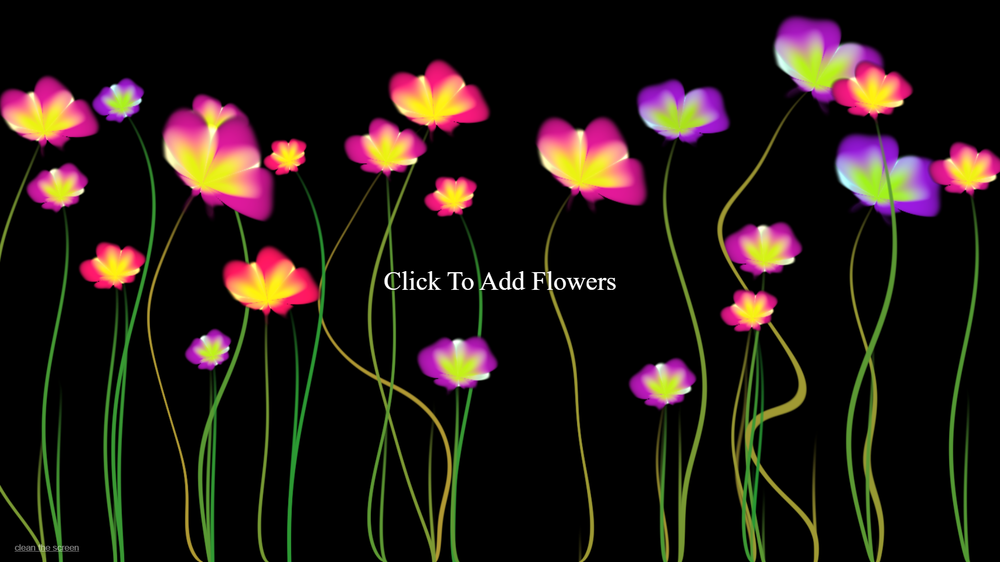

# Draw With Flowers – WebGL Canvas



An interactive WebGL sketch where you **draw with procedural flowers** using a custom GLSL fragment shader and Three.js.  
Click anywhere on the canvas to grow a new flower, and use the “clean the screen” button to reset the canvas. [web:60][web:74]

---

## 🌐 Live Demo

👉 **Try it in your browser:**  
(https://Andrew-Fernando-15.github.io/Click-to-grow-flower/index.html)

---

## ✨ Highlights

- Click or tap anywhere to grow **randomized flowers with stems** on a full‑screen canvas.
- Procedural shapes driven entirely by a **GLSL fragment shader** (no image textures).
- Uses a **feedback render target** so previous flowers stay on the screen until cleared.
- Simple **“clean the screen”** control to wipe the canvas and start fresh.

---

## 🧩 Tech Stack

- **HTML5** – canvas and basic layout  
- **CSS3** – fullscreen layout and minimal styling  
- **Vanilla JavaScript** – input handling and render loop  
- **Three.js** – WebGL renderer, shaders, and render targets

No frameworks or UI libraries – everything is hand‑coded to focus on shaders and core WebGL concepts.

---

## ▶️ Running Locally

1. Clone the repository:
   ```bash
   git clone https://github.com/andrew-fernando-15/click-to-grow-flower.git
   cd click-to-grow-flower
